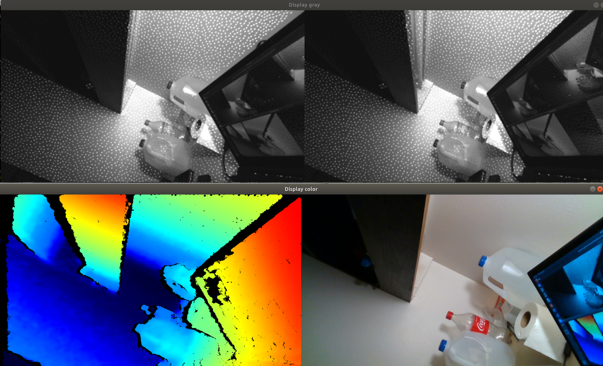
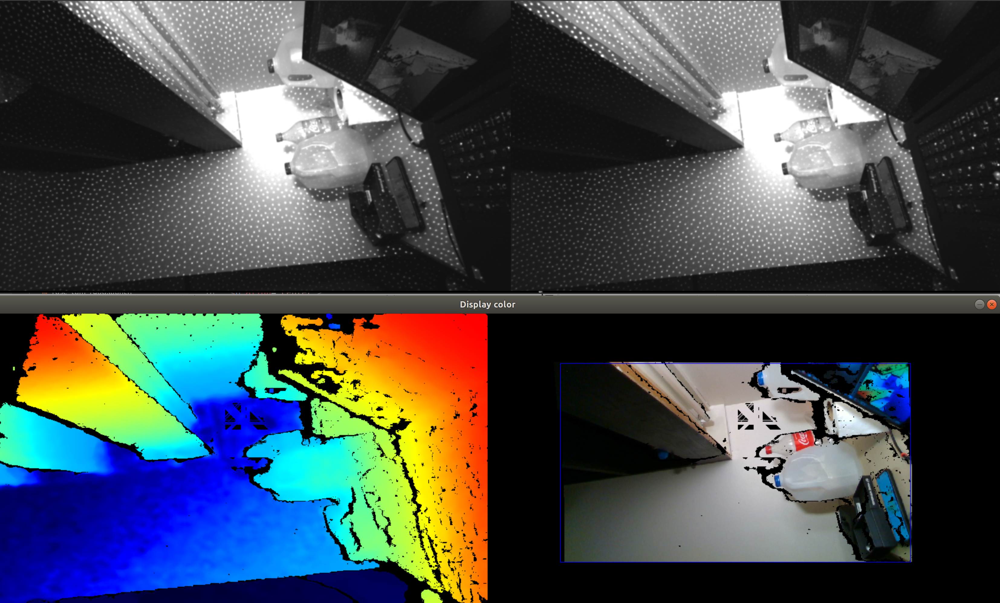

# DenseSurfelMapping
I modify this code to make it can run with realsense rgb. However, due to the realsense limitation, the rgb needs to align to the depth/ir sensor fisrt. The FOV of rgb is smaller than depth/ir sensor, which means after aligning, the rgb image will have a large black area. 
The following is an example image that rgb is not aligned, we can see the FOV of rgb is smaller.
<p align="center">

</p>
The following is an example of image that rgb is aligned, we can see there is a large black area and in the rectangle, some parts are still black because it lacks depth.
<p align="center">

</p>
Which makes it is difficult to visualize the rgb point cloud using realsense. I have to only use the image in that rectangle. The parameter in ```fuse_realsnese.launch```.<br>
```
    <param name="cam_width" value="580" />
    <param name="cam_height" value="330" />
    <param name="no_rgb_x" value="120" />
    <param name="no_rgb_y" value="82" />
```
`cam_width` and `cam_height` means the image size in that rectangle. `no_rgb_x` and `no_rgb_y` means the upper left pixel position of that rectangle.

**WARNING!**

**We have cleaned the code such that it can run without GPU acceleration. The code have not been fully tested after the refactoring. If you have any questions or suggestions, please let us know in the issue.**

## A depth map fusion method

This is a depth map fusion method following the ICRA 2019 submission **Real-time Scalable Dense Surfel Mapping**, Kaixuan Wang, Fei Gao, and Shaojie Shen.

Given a sequence of depth images, intensity images, and camera poses, the proposed methods can fuse them into a globally consistent model using surfel representation. The fusion method supports both [ORB-SLAM2](https://github.com/raulmur/ORB_SLAM2) and [VINS-Mono](https://github.com/HKUST-Aerial-Robotics/VINS-Mono) (a little modification is required) so that you can use it in RGB-D, stereo, or visual-inertial cases according to your setups. We develop the method based on the motivation that the fusion method: (1) can support loop closure (so that it can be consistent with other state-of-the-art SLAM methods),  (2) do not require much CPU/memory resources to reconstruct a fine model in real-time, (3) can be scaled to large environments. These requirements are of vital importance in robot navigation tasks that the robot can safly navigate in the environment with odometry-consistent dense maps.

An example to show the usage of the surfel mapping is shown below.

<p align="center">

</p>

Left is the overview of the environment, the middle is the reconstructed results (visualized as point clouds in rviz of ROS) of our method, and right is the result using [OpenChisel](https://github.com/personalrobotics/OpenChisel). We use VINS-Mono to track the camera motion with loop closure, and [MVDepthNet](https://github.com/HKUST-Aerial-Robotics/MVDepthNet) to estimate the depth maps. The black line is the path of the camera. In the reconstruction, loop closure is enabled to correct the detected drift. OpenChisel is a great project to reconstruct the environment using the truncated signed distance function (TSDF). However, as shown in the example, it is not suitable to be used with SLAM systems that have loop closure abilities.

The system can also be applied to the KITTI datasets in real-time with only CPU computation.

<p align="center">

</p>

The top row is the reconstruction using stereo cameras and the bottom row is the reconstruction using **only the left camera**. Details can be found in the paper.

A video can be used to illustrate the performance of the system and how we apply it into an autonomous navigation:
<p align="center">
<a href="https://youtu.be/2gZNpFE_yI4" target="_blank"></a>
</p>

## Running with VINS-Mono
We have use the surfel fusion with VINS-Mono in lots of UAV projects. For depth estimation, we recommend high quality depth methods/devices, for example [MVDepthNet](https://github.com/HKUST-Aerial-Robotics/MVDepthNet) or intel-realsense. Please refer to ```/launch/fuse_depthnet.launch``` for detailed parameters. The system takes paired image and depth map as input. Since VINS-Mono publishes imu poses, we also need to receive ```/vins_estimator/extrinsic``` for converting imu poses into camera poses.

## Ackonwledgement
We thank Gao Fei, Pan Jie, and Wang Luqi, for their contribution to the code and suggestions.